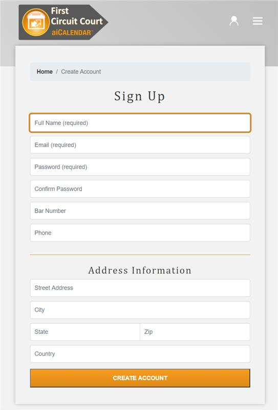

This takehome challenge for Mentis Technology was drafted in a CodePen originally, which can be found here: https://codepen.io/mdelarosa/pen/QWExaWX

##Audience
Attorneys and Self-Representing Litigants

##Provided Mockup

##Objectives

1. Implement client-side javascript form validations
2. Enhance user experience for mobile users
3. Improve styling while maintaining aiCalendar and Mentis Technology brand guidelines

##Design Notes

For the purpose of creating a quick mock-up in CodePen, I utilized an example device view of 410 x 700px. Happy to create a standalone app on GitHub that would display on mobile with responsive styling measurements instead if you wish. Also I am happy to create this as a react app to show the error handling in real time as the user types in each field instead. 

Logo is a placeholder for the aiCalendar logo, as I don’t have access to a mobile friendly version of it currently. 

Nav Bar: Decided to change to solid icons and change background to the blue from your brand palette instead of grayscale to improve contrast (especially on smaller devices).

Decided against using placeholders as labels as this reduces accessibility for screen readers. It also introduces short-term memory challenges for users who may suffer from mental impairments. 
https://www.nngroup.com/articles/form-design-placeholders/
https://www.w3.org/WAI/tutorials/forms/labels/

I separated the account information and contact information into two separate forms to keep a smaller range of focus for the user and prevent the user from having to scroll.

Provided additional context regarding why we are asking for their phone and physical address. 

I’m not doing anything with the form data currently as instructed, but if you want me to package it and put it in example POST request I am happy to.

##Validations Implemented

Name - 
Name fields cannot be blank
Trims data for extra white space before or after

Email - 
Email cannot be blank
Trims data for extra white space before or after  
Regex test for a valid email format

Password -
Password cannot be blank
Passwords must be greater than 8 characters
Passwords must be less than 15 characters
Passwords must contain at least one letter
Passwords must contain at least one number
Passwords must contain at least one special character

Password Confirmation -
Validations on this field do not occur until a valid password has been provided in password field, so that the user may focus on one error at a time.
Password confirmation cannot be blank
Password confirmation must match valid password provided

Phone - 
Cannot be blank
Must be in a valid ten digit format. See error messages. Accepts XXXXXXXXXX, XXX XXX XXXX, XXX-XXX-XXXX or  XXX.XXX.XXXX 

State - Implemented dropdown menu instead to pre-validate data